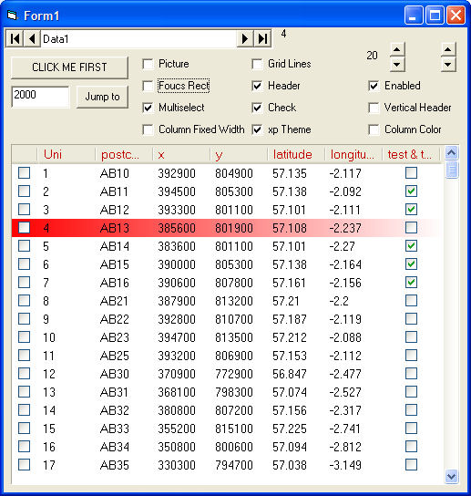



## Ownerdrawn Listbox for database

### Description

Complete ownerdrawn listbox with xp theme support, that can show and edit information from a database. Double click on text to edit the infomation.
 
### More Info
 

             |
---                |---
**Submitted On**   |2005-10-03 00:40:22
**By**             |[Gary Eyles](https://github.com/Planet-Source-Code/PSCIndex/blob/master/ByAuthor/gary-eyles.md)
**Level**          |Intermediate
**User Rating**    |5.0 (20 globes from 4 users)
**Compatibility**  |VB 6\.0
**Category**       |[Databases/ Data Access/ DAO/ ADO](https://github.com/Planet-Source-Code/PSCIndex/blob/master/ByCategory/databases-data-access-dao-ado__1-6.md)
**World**          |[Visual Basic](https://github.com/Planet-Source-Code/PSCIndex/blob/master/ByWorld/visual-basic.md)
**Archive File**   |[Ownerdrawn1937991062005\.zip](https://github.com/Planet-Source-Code/gary-eyles-ownerdrawn-listbox-for-database__1-62792/archive/master.zip)

